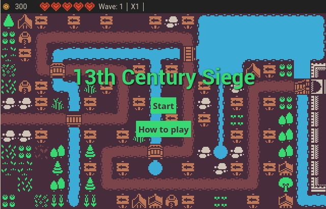

# 13th Century Siegue

  

## English

**13th Century Siegue** is a game of the Tower Defense genre that I am going to present to the **[js13kGames 2023](https://js13kgames.com/2023/games/13th-century-siege)** JAM.

Currently, the game features a two tower type and 3 enemy types.

The code for this game is under the **BSD 3-Clause License**, so you are free to download, modify, distribute and use it for your games under the terms of that license.

The graphics are licensed under **Creative Commons CC0** (Public Domain) and are the work of [Kenny](https://kenney.nl/assets/1-bit-pack).

[ZzFX](https://github.com/KilledByAPixel/ZzFX) is used for sound effects, under MIT license.

[Play](https://son-link.github.io/13th-century-siege)

## Acknowledgements:

* To [Kenney](https://kenney.nl/) for his great assets.
* To the staff of [JugandoEnLinux](https://jugandoenlinux.com), to Rafa Laguna for his advice and to a part of both communities for testing my game and giving me their opinion.
* And to all the other people who have put up with me throughout this game, especially in Mastodon, and who have also tested the game.

## Español

**13th Century Siege** es un juego del género Tower Defense que presente a la **[js13kGames 2023](https://js13kgames.com/2023/games/13th-century-siege)** JAM.

Actualmente, el juego cuenta 2 tipos de torre y 3 tipos de enemigos, pero espero implementar un segundo tipo de torre pronto.

El código de este juego está bajo la licencia **BSD 3-Clause License**, por lo que eres libre de descargarlo, modificarlo, distribuirlo y usarlo para tus juegos bajo los términos de dicha licencia.

Los gráficos están bajo licencia **Creative Commons CC0** (Dominio Público) y son obra de [Kenny](https://kenney.nl/assets/1-bit-pack).

[ZzFX](https://github.com/KilledByAPixel/ZzFX) se utiliza para efectos de sonido, bajo licencia MIT.

[Jugar](https://son-link.github.io/13th-century-siege)

## Agradecimientos:

* A [Kenney](https://kenney.nl/) por sus estupendos assets
* Al staff de [JugandoEnLinux](https://jugandoenlinux.com), a Rafa Laguna por sus consejos y a una parte de ambas comunidad por probar mi juego y darme su opinión.
* Y a todas las demás personas que a lo largo de este me han aguantado, sobre todo en Mastodon, y que también han probado el juego
